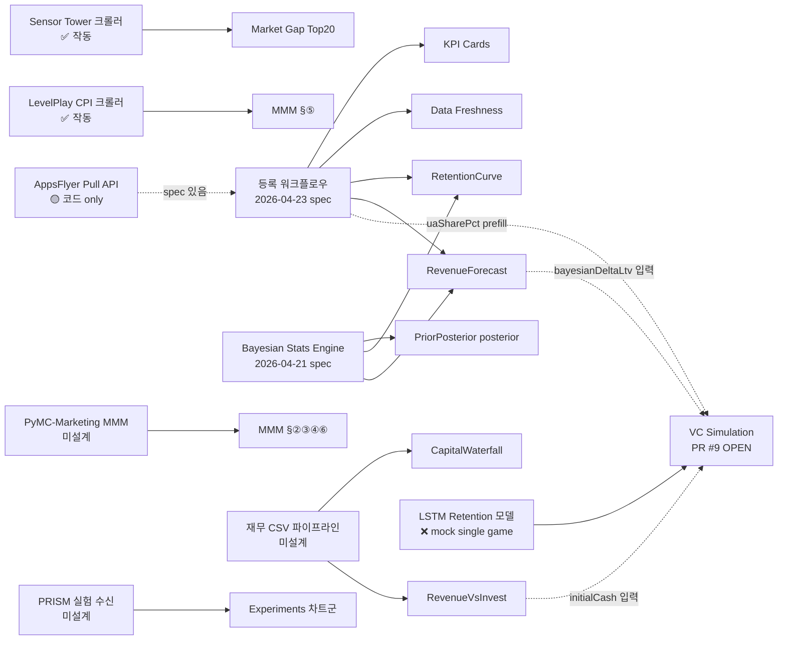

# Compass — 현황 평가 + 작업 묶음 정의

**작성일**: 2026-04-25 · **위상**: status (한 번 스캔하면 mock/real 즉답 가능)

이 문서는 spec 들의 **상위 인덱스**다. 코드 변경 0건. 5개 spec(AppsFlyer 파이프라인, AppsFlyer post-registration, Sensor Tower, MMM Phase 2 CPI, MMM Dashboard v2) + main 머지 직전인 VC Simulation MVP(PR #9 OPEN)가 어디까지 작동하고 어디부터 placeholder 인지 한 페이지로 수렴시킨다.

---

## §1. 페이지별 현황

| 페이지 | 논리 (답하려는 질문) | 사용성 | 차트 실/전체 | mock 의존도 | 다음 한 단계 |
|---|---|---|---|---|---|
| `/dashboard` (투자 판정) | 지금 이 게임/포트폴리오에 자본을 더 넣을지 빼야 할지 | OK — 5섹션 stagger 애니메이션, 게임 토글 작동 | **0 / 7** | 🟥 **100%** | W1 — AppsFlyer 등록으로 KPICards · DataFreshness 점등 |
| `/dashboard/market-gap` (시장 포지셔닝) | 우리 게임이 장르 평균 대비 어디 있나 + 어떤 경쟁자보다 위/아래인가 | OK — Top20 테이블 실데이터 + STALE 배지 | **1 / 5** + Top20 | 🟧 **80%** | W2 — Bayesian 엔진으로 PriorPosterior posterior 실연결 |
| `/dashboard/mmm` (채널 포화도) | 어떤 채널에 다음 1원을 더 넣고 어떤 채널에서 빼야 하는가 | OK — 6섹션, mROAS 임계값(1.4/1.0) 판정 | **2 / 7** (CPI 2개) | 🟧 **70%** | W3 — PyMC-Marketing 모델로 §②③④⑥ snapshot 갱신 |
| `/dashboard/prism` (실험) | 어떤 실험이 LTV 를 얼마 올렸는가 | 부족 — 3-stage roadmap card 만, status: planned | **0 / N** (placeholder) | ❌ | W5 — PRISM API 인터뷰 + spec 작성 |
| `/dashboard/connections` (데이터 연결) | 어느 데이터 소스가 살아있고 어디가 끊겨있나 | 부족 — Supabase 1개만 connected (mock), Save 버튼 setTimeout 900ms | — (UI catalog) | ❌ (전부 mock) | W1 (AppsFlyer 진짜 연결 = catalog 첫 번째 점등) |
| `/dashboard/vc-simulation` (VC 시뮬레이션, PR #9 OPEN) | 36개월 J-커브 / IRR / MOIC 가 LP 허들을 넘는가 | OK — Monte Carlo + RunwayFanChart 오버레이, IRR 히스토그램, dataSourceBadge | **계산 엔진 작동** (mock LSTM 입력) | 🟧 **70%** (compute 진짜, LSTM·offer 입력은 mock/derived) | W9 — LSTM retention 모델 실연결 (현재 single game mock) |

**누적 점수** (PR #9 머지 후 기준): 실데이터 위젯 **3종** + 진짜 compute 엔진 **1종 (VC sim Monte Carlo)**, placeholder/mock 위젯 **20+ 종**.

---

## §2. 데이터 파이프라인 매트릭스

| # | 소스 | 수집 코드 | 스토리지 | 소비 위젯 | 갱신 | 상태 |
|---|---|---|---|---|---|---|
| 1 | Sensor Tower (Merge × JP Top20) | `crawler/src/index.ts` (Playwright headed, OAuth) | `src/shared/api/data/sensor-tower/merge-jp-snapshot.json` | market-gap Top20 테이블, `priorByGenre.Merge.JP`, STALE 배지 | 주 1회 수동 (`npm run crawl:st`) | ✅ **작동** (fetchedAt 2026-04-20, 14일 룰) |
| 2 | Unity LevelPlay CPI Index | `crawler/src/cpi-benchmarks/ingest.ts` | `src/shared/api/data/cpi-benchmarks/levelplay-snapshot.json` | MMM §⑤ `CpiQuadrant`, `CpiBenchmarkTable`, `CurrentMarketChip` | 주 1회 (`npm run crawl:cpi`) | ✅ **작동** (generatedAt 2026-04-24, 35일 룰) |
| 3 | AppsFlyer Pull API v5 | `scripts/fetch-appsflyer.ts` + `src/app/api/appsflyer/sync` | `src/shared/api/data/appsflyer/snapshot.json` | (소비처 없음 — pipeline 만 존재) | 미정 | 🟡 **코드 only** (fetchedAt 1970-01-01, 빈 snapshot) |
| 4 | MMM Bayesian (response curve, saturation, contribution) | (미구현) | `src/shared/api/data/mmm/mock-snapshot.json` (source: `mock-v1`) | MMM §②③④⑥ 전부 (`SaturationMeter`, `ContributionDonut`, `ChannelStatusCard`, `ReallocationSummary`, `ResponseCurveCard`) | — | ❌ **mock** (gameKey: `poco`, generatedAt 2026-04-24) |
| 5 | Bayesian Posterior (retention/revenue) | (미구현) | — (mock-data.ts 하드코딩) | `PriorPosteriorChart` (D7/D30/ARPDAU), `RetentionCurve`, `RevenueForecast` P10/P50/P90 | — | ❌ **mock** (`mockPriorPosterior` percentage-scale 값) |
| 6 | Portfolio KPI / Title Health / Capital Waterfall / Market Context / Data Freshness | (미구현) | `src/shared/api/mock-data.ts` 하드코딩 | `/dashboard` 5섹션 거의 전체 | — | ❌ **mock** |
| 7 | PRISM 실험 메타 + 변이 결과 | (미구현) | — | `/dashboard/prism` (현재 placeholder) | — | ❌ |
| 8 | 재무/회계 CSV | (미구현) | — | `CapitalWaterfall`, `RevenueVsInvest` (mock-data.ts 의 `gameData.charts.*`) | — | ❌ csvSchema(6 컬럼) 정의만, 업로드 endpoint 없음 |
| 9 | Connections (Adjust / Singular / Gameboard / Supabase / Slack) | (미구현) | `src/shared/api/mock-connections.ts` | `/dashboard/connections` 7개 카드 | — | ❌ Supabase 만 `connected` 표시(실 연동 없음), 나머지 disconnected |
| 10 | LSTM Retention 모델 (월별 유지율 곡선 예측) | (미설계 — 모델 학습 환경 없음) | `src/shared/api/data/lstm/retention-snapshot.json` (PR #9 머지 후 등장) | VC Simulation `useVcSimulation` 훅, dataSourceBadge (LSTM staleness) | — | ❌ **mock**, single game `poko_merge` 만 — 실 학습 파이프라인 없음 |

**Stale 배지 헬퍼 3개** (`prior-data.isPriorStale(14)`, `mmm-data.isMmmStale()`, `cpi-benchmarks.isBenchmarkStale()`)는 모두 살아있고, UI에서 ⚠ 배지로 노출.

---

## §3. 작업 묶음 (Phase 단위)

### W1 — AppsFlyer 실연결 (선행 spec: 2026-04-23)

- **의존**: 사용자 토큰 등록 모달 + Vercel Blob private store + `/api/appsflyer/cron` (cron schedule)
- **실연결 대상**: `KPICards` (ROAS · BEP · Burn), `DataFreshnessStrip.lastSync`, `RetentionCurve` (cohort), `RevenueForecast` (in_app_events 누적), `PriorPosteriorChart` (posterior 입력)
- **명령**: `npm run fetch:af` (CLI 점등 검증), `POST /api/appsflyer/sync` (Web)
- **차단 요소**: 현재 `snapshot.json` 빈 파일(fetchedAt 1970-01-01) → 실 토큰 1회 돌리면 즉시 검증 가능

### W2 — Bayesian Stats Engine 적용 (spec 2026-04-21)

- **의존**: W1 의 cohort summary (실 retention 수치)
- **실연결 대상**: `PriorPosteriorChart` (posterior + 95% CI), `RetentionCurve` P10/P50/P90 밴드, `RevenueForecast` LogNormal fan
- **변경 파일**: `src/shared/api/prior-data.ts` (posterior 계산 진입점), `prior-posterior-chart.tsx`, `retention-curve.tsx`, `revenue-forecast.tsx`
- **차단 요소**: spec 만 있고 구현 PR 없음 — branch 자체 미시작

### W3 — MMM 모델 (PyMC-Marketing)

- **의존**: AppsFlyer spend/install (W1), 채널별 attributable installs
- **실연결 대상**: `SaturationMeter`, `ContributionDonut`, `ChannelStatusCard` 4종, `ResponseCurveCard`, `ReallocationSummary`
- **산출물**: `data/mmm/{gameKey}-snapshot.json` (현재 schema v2 그대로 유지, source `mock-v1` → `pymc-marketing-v1`)
- **차단 요소**: 모델 학습 환경(Python) · 계산 cadence 미설계 → **별도 spec 필요**

### W4 — 재무/회계 CSV 파이프라인

- **현재**: `mock-connections.ts:173` 에 csvSchema(month/account_code/account_name/amount_krw/type/memo, 6 컬럼) 정의만
- **실연결 대상**: `CapitalWaterfall`, `RevenueVsInvest` (`gameData.charts.capitalWaterfall`, `revenueVsInvest`)
- **필요**: 업로드 endpoint + Vercel Blob storage + Zod parser + monthly aggregation
- **차단 요소**: spec 없음

### W5 — PRISM 실험 수신

- **현재**: `/dashboard/prism` 전체 placeholder (3-stage roadmap card, status: planned)
- **실연결 대상 (보존 차트군)**: `ExperimentBar`, `VariantImpactChart`, `RolloutHistoryTimeline`, `RippleForecastFan`, `CausalImpactPanel`, `CumulativeImpactCurve`
- **차단 요소**: PRISM API 스펙 미정 — **사내 시스템 연동 인터뷰 필요**

### W6 — Sensor Tower Prior 다국가/다장르 확장

- **현재**: `Merge × JP` 1셀만 (`merge-jp-snapshot.json`)
- **확장**: `priorByGenre` 다중 키, crawler region/genre arg
- **트리거 조건**: 게임 설정에서 다른 (country, genre) 선택 시 market-gap 도 동적으로 응답해야 함

### W7 — LevelPlay CPI fallback (AppsFlyer Performance Index)

- **현재**: spec §13 에 fallback 시나리오만 정의, 구현 없음
- **트리거 조건**: LevelPlay endpoint 종료/유료화 시
- **작업**: PDF 파싱 모듈 + 동일 snapshot shape 출력

### W8 — Connection 카드 진짜 연결 (Slack / Gameboard / Adjust / Singular)

- **현재**: 7개 카드 중 Supabase 만 `connected` 상태 표시 (실 연동 없음, mock), 나머지 6개 disconnected/warn
- **우선순위**: Slack(주간 요약 알림) > Gameboard(인게임 이벤트 원천) > Adjust/Singular(MMP 대안)
- **차단 요소**: 각각 별도 spec 필요

### W9 — LSTM Retention 모델 실연결 (VC Simulation prerequisite)

- **현재**: PR #9 가 가져오는 `data/lstm/retention-snapshot.json` 은 single game(`poko_merge`) mock — 학습 파이프라인 없음
- **소비처**: `useVcSimulation` 훅 (월별 retention curve → cash flow), `dataSourceBadge` (staleness)
- **필요**: PyTorch/Keras LSTM 학습 코드 + AppsFlyer cohort 입력 (W1 의존) + 다 게임 전개
- **차단 요소**: 모델 학습 환경(Python) 미설계, single-game→multi-game 확장 설계 필요 — **별도 spec 필요**

### W10 — VC Simulation 본 머지 후 후속 (PR #9 머지 직후)

- **현재 상태**: 23 commits, 21/21 VC tests + 68/68 full suite pass, I-1(SSR hydration) · M-5(IRR histogram bin) post-review fix 완료, MERGEABLE
- **머지 후 자동 잠금 해제**: `RunwayFanChart` 가 보존 → 사용 중으로 이동, `IrrHistogramPair` 신규, `ScenarioSimulator` 와 인접 영역
- **남은 mock 의존**: LSTM(W9), `bayesianDeltaLtv` (W2 출력), `initialCash` (W4 재무 출력), `uaSharePct` prefill(W1 AppsFlyer UA cost ratio)
- **차단 요소**: 없음 — Mike 가 squash-merge 만 누르면 됨

---

## §4. UI/UX 준비도 정리

`src/widgets/charts/ui/` 32개 + `src/widgets/dashboard/ui/` 13개 = 차트/위젯 **45개** 살아있음.

### 4-1. 페이지에 깔린 위젯 (사용 중)

| 위젯 | 페이지 | 데이터 소스 | 상태 |
|---|---|---|---|
| `DecisionStoryCard` | dashboard, market-gap, mmm | mock-data.ts | ❌ mock |
| `KPICards` | dashboard | mock-data.ts | ❌ mock |
| `TitleHeatmap` | dashboard (portfolio only) | mock-data.ts | ❌ mock |
| `MarketContextCard` | dashboard (portfolio only) | mock-data.ts | ❌ mock |
| `DataFreshnessStrip` | dashboard | mock-data.ts | ❌ mock |
| `CapitalWaterfall` | dashboard | mock-data.ts | ❌ mock |
| `RevenueVsInvest` | dashboard | mock-data.ts | ❌ mock |
| `RevenueForecast` | dashboard | mock-data.ts | ❌ mock |
| `MarketBenchmark` | market-gap | mock-data.ts (`mockRetention.data`) | ❌ mock |
| `PriorPosteriorChart` | market-gap | mock-data.ts (`mockPriorPosterior`) | ❌ mock — posterior 미연동 |
| `RankingTrend` | market-gap | mock-data.ts | ❌ mock |
| `SaturationTrendChart` | market-gap | mock-data.ts | ❌ mock |
| Top20 테이블 | market-gap | sensor-tower snapshot | ✅ **real** |
| `SaturationMeter` | mmm | mmm/mock-snapshot.json | ❌ mock-v1 |
| `ContributionDonut` | mmm | mmm/mock-snapshot.json | ❌ mock-v1 |
| `ChannelStatusCard` | mmm (×4) | mmm/mock-snapshot.json | ❌ mock-v1 |
| `ChannelDetailModal` | mmm | mmm/mock-snapshot.json | ❌ mock-v1 |
| `CpiQuadrant` | mmm | levelplay-snapshot.json | ✅ **real** |
| `CpiBenchmarkTable` | mmm | levelplay-snapshot.json | ✅ **real** |
| `ReallocationSummary` | mmm | mmm/mock-snapshot.json | ❌ mock-v1 |
| `CurrentMarketChip` | mmm | game-settings store + cpi staleness | 🟡 (real staleness, mock chip metadata) |
| `ConnectionCard` ×7 | connections | mock-connections.ts | ❌ mock (Supabase만 `connected` 표시) |
| `RunwayFanChart` (overlay+hurdleLine 확장) | vc-simulation (PR #9) | compute.ts (Monte Carlo) + LSTM mock | 🟡 compute 진짜, 입력 mock |
| `IrrHistogramPair` (신규, M-5 bin alignment 픽스) | vc-simulation (PR #9) | compute.ts | 🟡 compute 진짜, 입력 mock |
| VC summary cards (IRR / MOIC / Hurdle, dataSourceBadge) | vc-simulation (PR #9) | useVcSimulation 훅 + LSTM staleness | 🟡 staleness 진짜, LSTM 데이터 mock |

### 4-2. 보존 차트 — 페이지에 안 깔렸지만 살아있음

향후 페이지 신설 시 즉시 재사용 가능. PRISM(W5) 들어가면 6개가 한 번에 점등 가능:

- **PRISM 후보** (6): `ExperimentBar`, `VariantImpactChart`, `RolloutHistoryTimeline`, `RippleForecastFan`, `CausalImpactPanel`, `CumulativeImpactCurve`
- **Cohort/Retention 분석** (3): `CohortHeatmap`, `RetentionCurve`, `RetentionShiftHeatmap`
- **Action/Roadmap** (3): `ActionTimeline`, `ActionRoiQuadrant`, `CyclicUpdateTimeline`
- **Capital/Runway** (2): `BudgetDonut`, `ScenarioSimulator` *(`RunwayFanChart` 는 PR #9 머지 후 vc-simulation 으로 이동)*
- **MMM 보조** (2): `SaturationBar`, `ExperimentRevenue`

→ **PR #9 머지 후 기준**: 페이지에 깔린 25개 + 보존 16개 = 41개 위젯 (UI 자체는 production-ready, 데이터 연결만 끊겨있음).

---

## §5. 한 줄 결론

**실데이터 2/10 소스, 진짜 점등된 위젯 3종 (Top20 + CpiQuadrant + CpiBenchmarkTable) + VC sim Monte Carlo compute 1종, UI는 41개 production-ready (PR #9 머지 후).**

다음 한 수는 **두 가지 동시 진행**:
1. **PR #9 squash-merge** (블로커 없음, Mike 가 클릭만) → vc-simulation 페이지 즉시 활성, RunwayFanChart 사용중으로 승격
2. **W1 — AppsFlyer 등록 워크플로우 머지** → KPI 4개 + DataFreshness + RetentionCurve 동시 점등 + VC sim 의 `uaSharePct` prefill 도 진짜로 변환

W1 끝나면 **W2(Bayesian) → W9(LSTM)** 가 순차적으로 잠금 해제됨 (Bayesian posterior + retention model 둘 다 AppsFlyer cohort 데이터 의존).

---

## 부록 — 4개 기존 spec 위치

| spec | 경로 | 본 문서의 어느 작업에 매핑되나 |
|---|---|---|
| Sensor Tower Crawler | `docs/superpowers/specs/2026-04-20-sensortower-crawler-design.md` | ✅ 운영 중 (W6 가 확장) |
| AppsFlyer API Pipeline | `docs/superpowers/specs/2026-04-20-appsflyer-api-pipeline-design.md` | W1 |
| AppsFlyer Post-Registration | `docs/superpowers/specs/2026-04-23-appsflyer-post-registration-workflow-design.md` | W1 |
| Bayesian Stats Engine | `docs/superpowers/specs/2026-04-21-bayesian-stats-engine-design.md` | W2 |
| MMM Phase 2 CPI | `docs/superpowers/specs/2026-04-24-mmm-phase-2-cpi-benchmark-design.md` | ✅ 운영 중 (W7 fallback) |
| MMM Dashboard v2 | `docs/superpowers/specs/2026-04-24-mmm-dashboard-v2-decision-focused.md` | W3 (모델 백엔드만 미구현) |
| VC Simulation MVP | (spec 없이 PR #9 직행 — `feat/vc-simulation` 브랜치) | W10 머지 + W9(LSTM) 후속 |

신규 spec 필요한 작업: **W3 (PyMC-Marketing), W4 (재무 CSV), W5 (PRISM API), W7 (CPI fallback), W8 (Slack/Gameboard/Adjust/Singular), W9 (LSTM Retention 학습 파이프라인)** — 본 문서에서는 정의만, spec 작성은 별도 작업.
