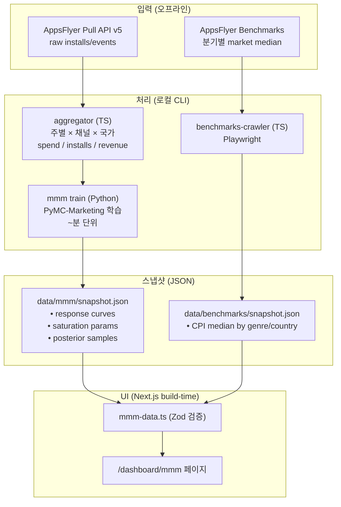

# MMM Dashboard — marginal 관점 예산 효율 분석 엔진 설계 스펙

**작성일**: 2026-04-24
**브랜치**: `feat/mmm-dashboard`
**관련 Spec**: `2026-04-20-appsflyer-api-pipeline-design.md`, `2026-04-21-bayesian-stats-engine-design.md`

---

## 0. 요약

Compass에 **MMM(Marketing Mix Modeling) 전용 독립 페이지 `/dashboard/mmm`**을 신설한다. 기존 ROAS/MMP(AppsFlyer)가 답하지 못하는 **"marginal 질문"**(지금 이 채널에 돈을 더 넣어야 하는가? 단가가 적절한가?)에 답하는 독립 판단 레이어다.

- **Phase 1 (이번 범위)**: UI + Mock Snapshot + Methodology Modal
- **Phase 2**: AppsFlyer Benchmarks 크롤러 (분기별 시장 median CPI 수집)
- **Phase 3**: Python `mmm/` 패키지 + PyMC-Marketing 실학습 + Budget Optimization 차트 추가

---

## 1. 동기 (Why MMM)

### 1.1 ROAS·MMP로 답할 수 없는 질문

| 질문 | 답하는 도구 |
|------|-------------|
| "어느 채널이 잘 했나?" (평균) | ROAS (기존 위젯) |
| **"어느 채널이 포화됐나?" (marginal)** | **MMM** |
| **"지금 spend 수준에서 적정 단가는?"** | **MMM** |
| "시장 평균 대비 우리 CPI?" | **MMM + AppsFlyer Benchmarks** |
| "장르 기대치 대비 우리?" (분포) | Bayesian prior (기존) |

ROAS는 **과거 평균**, MMM은 **미래 marginal**. Compass에서 MMM은 독립 사일로가 아니라 **Silo 1(Market) · Silo 2(Attribution)를 융합하여 marginal 질문에 답하는 레이어**.

### 1.2 이 페이지의 고유 가치

한 차트(Response Curve) 안에 **두 답이 동시**에 담긴다:

- Saturation 여부 = 곡선의 모양 + 현재 위치의 관계
- 단가 적절성 = 현재 위치의 기울기(= 1 / marginal CPI)

MMM의 진짜 미학: **하나의 response curve가 "얼마나 포화됐나"와 "이 가격이 자연스러운가"를 동시에 답한다.**

---

## 2. 오픈소스 선택 — PyMC-Marketing

| 라이브러리 | 판정 | 이유 |
|------------|------|------|
| **PyMC-Marketing** | ✅ **채택** | Bayesian-native → 기존 Beta-Binomial·log-normal 엔진과 철학 일치. Adstock·saturation 1급 prior. 2025–2026 활발한 릴리스. Python 단일. |
| Google Meridian | 백업 (Phase 4+) | Google 지원, geo-level, Bayesian. TF Probability 의존·학습 커브 가파름. |
| Google LightweightMMM | ❌ | Google이 Meridian으로 deprecate 중. |
| Meta Robyn | ❌ | R 기반 → TS/Next 파이프라인과 이질적. |

**선택 근거**: Compass 전체가 Bayesian prior/posterior 기반이라 MMM도 같은 통계 철학으로 가면 결과가 **한 판단 레이어로 통합**된다. Market Gap 페이지의 prior 분석 ↔ MMM 페이지의 saturation 분석이 같은 통계 언어(p10/p50/p90, posterior)로 말함.

---

## 3. 아키텍처

### 3.1 데이터 흐름



### 3.2 실행 주기

| 단계 | 주기 | 주체 | 트리거 |
|------|------|------|--------|
| AppsFlyer raw 수집 | 주 1회 | `feat/appsflyer-workflow` | cron |
| MMM 학습 | **분기** | 사람 (로컬 CLI) | 수동 `npm run mmm:train` |
| Benchmarks 크롤링 | 분기 | 사람 | 수동 `npm run crawl:afb` |
| Next.js 빌드 | 배포 시 | Vercel | push → build-time import |

> 분기 주기는 AppsFlyer Benchmarks 업데이트 주기(1·4·7·10월 7일경)와 자연 일치.

### 3.3 Phase 분리

| Phase | 산출물 | 상태 |
|-------|--------|------|
| **1 (이번 PR)** | UI + Mock Snapshot + Methodology Modal | 이 문서 범위 |
| **2** | `crawler/appsflyer-benchmarks/` 추가 (Sensor Tower 크롤러 복제) | 별도 PR |
| **3** | `mmm/` Python 패키지 + PyMC-Marketing 실학습 + Budget Optimization 차트 | 별도 PR |

---

## 4. 기술 스택

### 4.1 Phase 1 (Next.js 프론트엔드 only)

기존 Compass 스택 그대로. 새 의존성 **없음**.

| 영역 | 기술 | 비고 |
|------|------|------|
| Framework | Next.js 15 App Router | 기존 |
| Validation | Zod | 기존 (prior-data.ts 패턴 복제) |
| Chart | Recharts | 기존 |
| Layout | Framer Motion + `useGridLayout` | 기존 |
| UI | Tailwind v4 + Radix | 기존 |
| State | React state (expand 토글) | 기존 패턴 |

### 4.2 Phase 2 (AppsFlyer Benchmarks 크롤러)

기존 `crawler/` 패턴을 **그대로 복제**하여 `crawler/appsflyer-benchmarks/` 신설.

| 영역 | 기술 | 비고 |
|------|------|------|
| Runtime | Node.js 24 LTS + ESM | Sensor Tower 크롤러와 동일 |
| Browser | Playwright headed Chromium | OAuth/로그인 세션 재사용 |
| Schema | Zod | 동일 패턴 |
| Session | `storageState.json` | 동일 보안 정책 |

**접근성 확인 결과 (2026-04-24 스파이크):**
- URL: `appsflyer.com/benchmarks/` (접속 가능)
- 필터: Category / Sub-category / Country-Region / Channel
- **무료 회원가입 후 접근** (freemium)
- 갱신: 분기별 (1·4·7·10월 7일경)
- Retention 2개월 cohort lag (MMM 학습에는 오히려 장점 — cohort 완결 데이터)
- Sensor Tower taxonomy 사용 → 기존 `merge-jp-snapshot.json`과 조인 가능

### 4.3 Phase 3 (Python MMM 패키지)

새 패키지 `mmm/` — `crawler/`처럼 독립.

| 영역 | 기술 | 비고 |
|------|------|------|
| Runtime | Python 3.13 | |
| MMM 엔진 | **PyMC-Marketing** | |
| 수치 연산 | PyMC 5 + NumPy + Pandas + ArviZ | PyMC-Marketing 의존 |
| Schema I/O | Pydantic (Python 측 Zod 대응) + pyarrow | AppsFlyer snapshot 읽기 |
| CLI | Typer | Commander의 Python 버전 |
| 패키지 매니저 | `uv` | pip 대체, Rust-speed lock 재현성 |
| 출력 | JSON snapshot (Zod 호환) | Phase 1 mock과 **스키마 동일** |

**`uv` 선택 근거**: Python 진영에서 `pip`은 재현성이 약해 Phase 3 학습 환경 복원이 문제. `uv`는 lock 파일로 재현성 확보 — 포트폴리오 관점에서 "production-grade Python"의 지표.

---

## 5. 페이지 구조 결정

### 5.1 독립 페이지 vs 하위 섹션 — 독립 페이지 채택

| 기준 | 독립 페이지 조건 | MMM 평가 |
|------|-------------------|----------|
| 주제 독립성 | 기존 페이지와 다른 질문에 답하는가? | ✅ "marginal 질문"은 고유 |
| 정보 밀도 | 최소 2-3차트 + methodology가 필요한가? | ⚠️ Phase 1 단일 차트, Phase 3에서 확장 |
| 판단 레이어 독립성 | 단독 의사결정 화면이 되는가? | ✅ "예산 더 넣을까" 단독 결정 가능 |
| 확장 여지 | Phase 2/3로 커질 계획이 있는가? | ✅ 크롤러 + Python 학습 파이프라인 |

**결론: 4개 기준 중 3.5개 충족 → 독립 페이지.**

### 5.2 네비게이션 구조

```
Sidebar (3-페이지 체제로 확장)
├── Executive Overview  /dashboard                "지금 투자를 늘려야 하는가?"
├── Market Gap          /dashboard/market-gap     "시장에서 우리의 위치는?"
└── MMM (채널 포화도)    /dashboard/mmm            "지금 돈을 더 넣어야 할까?"
```

기존 페이지들의 **질문형 타이틀** 패턴과 일치. 3페이지 체제는 "단출한 대시보드"에서 **"의사결정 OS"**로의 정체성 전환점.

---

## 6. Phase 1 스냅샷 스키마

### 6.1 설계 원칙

| 원칙 | 의미 |
|------|------|
| PyMC-Marketing 출력 형태 준수 | Phase 3에서 JSON만 교체, TS 코드 변경 불필요 |
| Decision-first precompute | verdict는 스냅샷에 precompute (React에서 계산 금지) |
| Recharts 친화적 | 곡선은 `{spendGrid, p10, p50, p90}` 배열 (함수 평가 없음) |
| prior-data.ts 패턴 복제 | Zod parse → named exports → build-time 검증 |

### 6.2 Zod 스키마 (전체)

```typescript
// src/shared/api/mmm-data.ts 내 정의

const ResponseCurveSchema = z.object({
  spendGrid: z.array(z.number().nonnegative()).min(10).max(50),
  p10: z.array(z.number().nonnegative()),
  p50: z.array(z.number().nonnegative()),
  p90: z.array(z.number().nonnegative()),
}).refine(
  (c) => c.spendGrid.length === c.p10.length
      && c.p10.length === c.p50.length
      && c.p50.length === c.p90.length,
  "curve arrays must have equal length"
)

const SaturationSchema = z.object({
  halfSaturation: z.number().positive(),   // Hill function의 K (knee point)
  hillCoefficient: z.number().positive(),  // n (기울기)
})

const ChannelSchema = z.object({
  key: z.enum(["meta", "google", "tiktok", "apple-search"]),
  label: z.string(),
  responseCurve: ResponseCurveSchema,
  currentSpend: z.number().nonnegative(),
  currentInstalls: z.number().int().nonnegative(),
  saturation: SaturationSchema,
  marginal: z.object({
    cpi: z.number().positive(),
    roas: z.number().nonnegative(),
  }),
  benchmark: z.object({
    marketMedianCpi: z.number().positive(),
    marketMedianRoas: z.number().nonnegative(),
    source: z.string(),
  }),
})

const VerdictSchema = z.object({
  status: z.enum(["invest", "hold", "reduce"]),
  confidence: z.number().min(0).max(1),
  headline: z.object({
    ko: z.string(),
    en: z.string(),
  }),
  metrics: z.array(z.object({
    label: z.object({ ko: z.string(), en: z.string() }),
    value: z.string(),
  })).min(3).max(5),
})

export const SnapshotSchema = z.object({
  $schemaVersion: z.literal(1),
  metadata: z.object({
    generatedAt: z.string().datetime(),
    source: z.enum(["mock-v1", "pymc-marketing-v1"]),
    gameKey: z.enum(["portfolio", "match-league", "weaving-fairy", "dig-infinity"]),
    fiscalWindow: z.object({
      from: z.string().regex(/^\d{4}-\d{2}-\d{2}$/),
      to: z.string().regex(/^\d{4}-\d{2}-\d{2}$/),
    }),
    currency: z.enum(["KRW", "USD", "JPY", "EUR"]),
  }),
  verdict: VerdictSchema,
  channels: z.array(ChannelSchema).length(4),
})
```

### 6.3 주요 설계 결정

**곡선 = 배열 (함수 아님)**
Recharts는 포인트 배열만 받음. Frontend에서 Hill function 평가하려면 수치 라이브러리 필요 → 피함. PyMC-Marketing도 posterior 샘플을 spend grid에 evaluate해서 내보내므로 **출력 형태가 일치**.

**30포인트 그리드 기본**
곡선 스무스함에 충분. JSON 크기 ~5KB/채널. 50포인트까지 허용(Phase 3 확장 여지).

**`saturation.halfSaturation`을 곡선과 별도 저장**
Knee 마커 수직 참조선 + verdict 로직에서 "현재 spend / halfSaturation 비율"로 포화도 계산. PyMC-Marketing 출력에 native parameter로 포함.

**verdict를 JSON에 precompute**
Frontend 로직 단순화. Phase 3 optimizer가 진짜 최적 결정을 덮어쓸 수 있음. `DecisionStoryCard`가 그냥 받아 렌더.

**`benchmark`를 채널마다 중복 저장**
Phase 2에서 크롤러 snapshot이 독립적으로 업데이트됨. 빌드 시 병합. Phase 1은 mock 하드코딩.

**i18n 문자열을 스냅샷에 포함**
verdict headline/metric label은 **데이터에 의존**(예: "Google에 여력" vs "TikTok에 여력"). dictionary.ts에 하드코딩 불가 → 스냅샷이 ko/en 둘 다 제공.

**`$schemaVersion: z.literal(1)`**
Phase 3에서 스키마 바뀌면 literal을 2로 올리고 parser 분기. 이전 snapshot이 실수로 섞이는 걸 build-time에 차단.

### 6.4 Mock Snapshot 예시 (match-league, Meta 채널 1개)

```json
{
  "$schemaVersion": 1,
  "metadata": {
    "generatedAt": "2026-04-24T00:00:00.000Z",
    "source": "mock-v1",
    "gameKey": "match-league",
    "fiscalWindow": { "from": "2026-01-01", "to": "2026-03-31" },
    "currency": "USD"
  },
  "verdict": {
    "status": "hold",
    "confidence": 0.72,
    "headline": {
      "ko": "Google에 여력, Meta 포화 — 재배분 시점",
      "en": "Room in Google, Meta saturated — time to reallocate"
    },
    "metrics": [
      { "label": { "ko": "총 Spend", "en": "Total Spend" }, "value": "$320K" },
      { "label": { "ko": "평균 mROAS", "en": "Avg mROAS" }, "value": "1.2×" },
      { "label": { "ko": "포화 채널", "en": "Saturated" }, "value": "2 / 4" }
    ]
  },
  "channels": [
    {
      "key": "meta",
      "label": "Meta Ads",
      "responseCurve": {
        "spendGrid": [0, 10000, 30000, 60000, 100000, 150000, 200000],
        "p10":       [0,  1800,  4200,  6800,   8900,  10100,  10800],
        "p50":       [0,  2200,  5400,  9100,  12000,  13800,  14900],
        "p90":       [0,  2600,  6800, 11500,  15200,  17600,  19100]
      },
      "currentSpend": 120000,
      "currentInstalls": 12500,
      "saturation": { "halfSaturation": 85000, "hillCoefficient": 1.6 },
      "marginal": { "cpi": 4.20, "roas": 0.9 },
      "benchmark": {
        "marketMedianCpi": 3.80,
        "marketMedianRoas": 1.3,
        "source": "mock"
      }
    }
    // ... google / tiktok / apple-search 채널 데이터 동일 구조
  ]
}
```

---

## 7. UI 컴포넌트 설계

### 7.1 파일 레이아웃

```
src/
├── app/(dashboard)/dashboard/mmm/
│   └── page.tsx                          # 신규 — 페이지 조립만
│
├── widgets/
│   ├── dashboard/ui/
│   │   └── decision-story-card.tsx       # 기존 재사용 (수정 없음)
│   └── charts/ui/
│       ├── response-curve-grid.tsx       # 신규 — 2×2 컨테이너
│       └── response-curve-card.tsx       # 신규 — 개별 채널 (compact/expanded)
│
└── shared/
    ├── api/
    │   ├── mmm-data.ts                   # 신규 — Zod parse + named exports
    │   └── data/mmm/
    │       └── mock-snapshot.json        # 신규 — 4채널 mock
    └── ui/
        └── methodology-modal.tsx          # 기존 재사용 (수정 없음)
```

**신규 파일 5개, 재사용 자산 2개.**

### 7.2 ResponseCurveCard — Compact 뷰 (2×2 그리드 셀)

```
┌────────────────────────────────┐
│  Meta Ads              ⬈ [+]  │ ← ChartHeader + ExpandButton
│  ─────────────────────────     │
│                                │
│            ╱‾‾‾‾ ← p10-p90 밴드│
│       ╭──━━━━━━━━━━━━━━━━ ●   │ ← p50 라인 + 현재 위치(●)
│      ╱                         │
│    ╱                           │
│   ───────────────────────────  │
│                                │
│  ┌──────────┬──────────┐       │
│  │ mCPI     │ 포화도   │       │ ← 압축 메트릭 2개
│  │ $4.20    │ 78%  ▲   │       │
│  └──────────┴──────────┘       │
└────────────────────────────────┘
```

**렌더링 요소:**
- `ChartHeader` (title + ExpandButton) — 기존 컴포넌트
- Recharts `ComposedChart`:
  - `Area` (p10→p90) opacity 20% (PALETTE.cohort별 색상)
  - `Line` (p50)
  - 현재 위치 `ReferenceDot` (● 마커)
- 하단 2-col 메트릭: mCPI + 포화도(%)
- 축 라벨/그리드 **숨김** (compact 밀도 우선)

### 7.3 ResponseCurveCard — Expanded 뷰 (full-width)

```
┌──────────────────────────────────────────────────────────┐
│  Meta Ads — $120K spend / $4.20 mCPI     📊 방법론  [×]│
│  ────────────────────────────────────────────────────── │
│                                                          │
│  Revenue  ▲                                              │
│    $25K  │            ╱‾‾‾‾‾‾‾‾‾‾                      │
│          │         ╱                ← Saturation point  │
│    $20K  │      ╱ ┊                   $85K              │
│          │    ╱   ┊                                      │
│    $15K  │  ╱     ┊                                     │
│          │ ╱      ┊                                     │
│    $10K  │╱━━━━━━● Market median $3.80                 │
│          │       ┊  ← 현재 spend $120K                  │
│     $5K  │       ┊                                      │
│          │       ┊                                      │
│      $0  └───────┴────────────────────▶ Spend           │
│           $0   $50K   $100K   $150K   $200K            │
│                                                          │
│  ─────────────────────────────────────────────────────  │
│  ┌───────────┬───────────┬───────────┬───────────┐     │
│  │ 현재 Spend │ 현재 mCPI │ 시장 median│ 포화 도달 │     │
│  │ $120K     │ $4.20     │ $3.80      │ 78%       │     │
│  └───────────┴───────────┴───────────┴───────────┘     │
└──────────────────────────────────────────────────────────┘
```

**추가 요소:**
- 축 라벨 + 틱 + 그리드 선 (`CHART_TYPO.axis` 폰트)
- `ReferenceLine` 수직 (Saturation point) — dashed, 주석 라벨
- `ReferenceLine` 수평 (Market median CPI) — dashed, 주석 라벨
- 현재 위치 수직 dotted 라인 (spend 표기)
- 4-col 메트릭 행 (compact의 2개 → 4개 확장)
- 📊 방법론 버튼 → `MethodologyModal` 오픈

### 7.4 ResponseCurveGrid — 2×2 컨테이너

확장 시 **다른 3개 카드를 숨김** → 확장 뷰에 모든 공간 할당. `[×]` 버튼으로 2×2 복귀.

**이유:**
- 4개 카드를 compact 아래로 계속 보이게 하면 화면이 세로로 길어짐
- 확장 뷰가 "이 채널에 집중하는 분석 모드"라는 의미 강화
- Compass `useGridLayout` 훅의 2-col 패턴과 호환

### 7.5 페이지 조립

```tsx
// src/app/(dashboard)/dashboard/mmm/page.tsx
"use client"

export default function MmmPage() {
  const { locale } = useLocale()

  return (
    <PageTransition>
      <FadeInUp delay={0}>
        <PageHeader titleKey="mmm.title" subtitleKey="mmm.subtitle" />
      </FadeInUp>

      <FadeInUp delay={0.1}>
        <DecisionStoryCard
          status={mmmVerdict.status}
          confidence={mmmVerdict.confidence}
          headline={mmmVerdict.headline[locale]}
          metrics={mmmVerdict.metrics.map(m => ({
            label: m.label[locale],
            value: m.value,
          }))}
          stale={isMmmStale()}
        />
      </FadeInUp>

      <FadeInUp delay={0.2}>
        <ResponseCurveGrid channels={mmmChannels} />
      </FadeInUp>
    </PageTransition>
  )
}
```

`market-gap/page.tsx`의 조립 문법 그대로 복제.

### 7.6 색상 매핑

```typescript
// src/shared/config/chart-colors.ts 에 추가
export const MMM_COLORS = {
  channels: {
    meta:           { line: PALETTE.cohort2, band: PALETTE.cohort2_alpha },
    google:         { line: PALETTE.cohort1, band: PALETTE.cohort1_alpha },
    tiktok:         { line: PALETTE.cohort4, band: PALETTE.cohort4_alpha },
    "apple-search": { line: PALETTE.cohort3, band: PALETTE.cohort3_alpha },
  },
  saturationPoint: PALETTE.caution,   // knee 마커
  marketMedian:    PALETTE.positive,  // 기준선 (중립)
  currentPosition: PALETTE.brand,     // 현재 위치
  axis:            PALETTE.fg2,
  grid:            PALETTE.bg3,
} as const
```

**의도적 정치 중립**: 채널(Meta/Google/TikTok)에 개별 색을 고정하면 채널 bias가 색 선택에 드러남. PALETTE.cohort 순서(1→2→3→4)로 일관된 채널 ID 매핑 → "우리는 채널 선호 없음" 신호.

### 7.7 MethodologyModal 내용

```
Marketing Mix Modeling — 어떻게 계산하나?

1. Adstock (캐리오버 효과)
   오늘의 광고가 내일 install을 유발할 수도 있음.
   지수 감쇠 파라미터로 지연 효과 모델링.

2. Saturation (한계 수익 체감)
   Hill function: revenue = β · S^n / (S^n + K^n)
   K = 반포화점(half-saturation) — 이 spend의 2배에서 최대 효과의 ~67% 달성.

3. Bayesian Prior (사전 분포)
   PyMC-Marketing이 각 파라미터에 약한 prior 적용 → posterior p10/p50/p90 밴드 생성.
   Market Gap 페이지의 prior/posterior 분석과 같은 통계 언어.

4. 한계
   Phase 1: Mock snapshot 기반 데모.
   Phase 3에서 실제 AppsFlyer 데이터로 PyMC-Marketing 학습 예정.
```

---

## 8. 파일 변경 목록 (Phase 1)

### 신규 (6개)

1. `src/app/(dashboard)/dashboard/mmm/page.tsx`
2. `src/widgets/charts/ui/response-curve-grid.tsx`
3. `src/widgets/charts/ui/response-curve-card.tsx`
4. `src/shared/api/mmm-data.ts`
5. `src/shared/api/data/mmm/mock-snapshot.json`
6. `src/shared/api/__tests__/mmm-data.test.ts` (Zod parse 검증)

### 수정 (5개)

1. `src/shared/config/navigation.ts` — `nav.mmm` 엔트리 추가
2. `src/shared/config/chart-colors.ts` — `MMM_COLORS` 추가
3. `src/widgets/charts/index.ts` — 2 export 추가
4. `src/shared/api/index.ts` — `export * from "./mmm-data"` 추가
5. `src/shared/i18n/dictionary.ts` — ~17개 i18n 키 추가

### i18n 키 목록

```
nav.mmm                    채널 포화도 / Saturation
mmm.title                  지금 돈을 더 넣어야 할까? / Should We Spend More?
mmm.subtitle               채널별 marginal 수익 분석 / Marginal Channel Analysis
mmm.channel.meta           Meta Ads / Meta Ads
mmm.channel.google         Google Ads / Google Ads
mmm.channel.tiktok         TikTok / TikTok
mmm.channel.appleSearch    Apple Search / Apple Search
mmm.metric.mCPI            marginal CPI / Marginal CPI
mmm.metric.saturation      포화 도달 / Saturation
mmm.metric.currentSpend    현재 Spend / Current Spend
mmm.metric.marketMedian    시장 median / Market Median
mmm.ref.saturationPoint    반포화점 / Half-saturation
mmm.methodology.title          MMM 방법론 / MMM Methodology
mmm.methodology.adstock        Adstock(캐리오버) / Adstock (Carryover)
mmm.methodology.saturation     Saturation / Saturation
mmm.methodology.bayesian       Bayesian Prior / Bayesian Prior
mmm.methodology.limitations    한계 / Limitations
```

---

## 9. 재사용 자산 (새로 만들지 않음)

| 자산 | 위치 | 용도 |
|------|------|------|
| `DecisionStoryCard` | `src/widgets/dashboard/ui/` | MmmHeroVerdict (status/headline/metrics) |
| `MethodologyModal` | `src/shared/ui/` | 방법론 설명 모달 |
| `ChartHeader` | `src/shared/ui/` | 차트 제목 + ExpandButton |
| `ChartTooltip` | `src/shared/ui/` | 차트 툴팁 |
| `ExpandButton` | `src/shared/ui/` | 확장 토글 |
| `useChartExpand` | `src/shared/hooks/` | 확장 상태 관리 |
| `useGridLayout` | `src/shared/hooks/` | 2-col ↔ full-width 전환 |
| `PageTransition`, `FadeInUp` | `src/shared/ui/` | 섹션 stagger 애니메이션 |
| `PALETTE.cohort1..6` | `src/shared/config/chart-colors.ts` | 채널 색상 |
| `CHART_TYPO` | `src/shared/config/chart-typography.ts` | 차트 폰트 |

---

## 10. 검증 절차

### 10.1 빌드 타임

1. `npm run build` — Zod 파싱 성공 (실패 시 build 에러)
2. `npm run lint` — 0 에러
3. TypeScript strict 통과

### 10.2 런타임

1. `npm run dev` → `http://localhost:3000/dashboard/mmm`:
   - `DecisionStoryCard` 상단 노출, 4채널 Response Curve 2×2 렌더
   - 사이드바 "채널 포화도" 항목 활성 상태
   - 각 카드 `ExpandButton` 클릭 → full-width 전환 + 다른 3카드 숨김
   - `[×]` 버튼 → 2×2 복귀
   - 📊 방법론 버튼 → `MethodologyModal` 오픈
2. 로케일 토글 (ko↔en): 신규 17개 키 모두 번역 존재
3. 반응형: 1440px / 768px 에서 grid 정상
4. 기존 페이지 회귀 없음

### 10.3 단위 테스트

- `mmm-data.test.ts` — Mock snapshot이 `SnapshotSchema.parse()` 통과
- 배열 길이 refine 검증 (spendGrid·p10·p50·p90 동일 길이)
- `isMmmStale()` / `mmmAgeDays()` 경계값 검증

---

## 11. 비 스코프 (Phase 1에서 하지 않는 것)

- **Budget Optimization 차트** — Phase 3으로 연기 (실제 optimizer가 있어야 의미 있음)
- **Channel Contribution 차트** — ROAS로 이미 답하는 질문, 불필요
- **AppsFlyer Benchmarks 크롤러** — Phase 2
- **Python `mmm/` 패키지** — Phase 3
- **Runtime Python** — Hobby 플랜 static build 정책 유지
- **Geo-level 분해, event dummies (iOS update, 가격 변경), 다게임 MMM**

---

## 12. Phase별 페이지 진화

| Phase | 추가되는 것 | 포트폴리오 서사 |
|-------|-------------|-----------------|
| **1** | Mock snapshot + Response Curves + Methodology | "MMM으로 이런 질문에 답할 수 있다" |
| **2** | AppsFlyer Benchmarks 크롤러 → 시장 median **실제** 연동 | "4개 사일로 중 3번째 연결 완료" |
| **3** | Python `mmm/` CLI + PyMC-Marketing 학습 + Budget Optimization 차트 | "Marketing Mix 최적화 가능한 완결 제품" |

같은 페이지가 **Phase를 거치며 점진적으로 깊어지는** 구조.

---

## 13. 의존 관계

### 13.1 다른 Spec과의 관계

- **2026-04-20-appsflyer-api-pipeline-design.md**: Phase 3에서 AppsFlyer raw 데이터를 aggregation → MMM 학습 input으로 소비
- **2026-04-21-bayesian-stats-engine-design.md**: Market Gap의 Bayesian prior/posterior와 같은 통계 언어 사용 (p10/p50/p90, posterior)
- **2026-04-20-sensortower-crawler-design.md**: Phase 2 AppsFlyer Benchmarks 크롤러가 이 패턴을 **그대로 복제**

### 13.2 브랜치 전략

- **현재 브랜치**: `feat/mmm-dashboard` (main 분기)
- **독립성**: `feat/appsflyer-workflow`와 무관 → 병렬 진행 가능
- **PR 대상**: `main`

---

## 14. 오픈 질문

현재 없음. Phase 1 구현 시작 가능.

---

## Appendix A: 참고 자료

- PyMC-Marketing 문서: https://www.pymc-marketing.io/
- AppsFlyer Benchmarks: https://www.appsflyer.com/benchmarks/
- AppsFlyer Benchmarks FAQ: https://www.appsflyer.com/benchmarks/faq/
- AppsFlyer Performance Index 2025: https://www.appsflyer.com/resources/reports/performance-index/

## Appendix B: 용어

- **MMM (Marketing Mix Modeling)**: 채널별 spend → 성과 관계를 통계적으로 모델링하는 top-down 기법
- **MMP (Mobile Measurement Partner)**: AppsFlyer처럼 개별 click을 install에 귀속시키는 bottom-up 어트리뷰션
- **Adstock**: 오늘의 광고가 미래의 install을 유발하는 캐리오버 효과
- **Saturation**: spend 증가에 따른 수익의 한계 체감 현상
- **mROAS / marginal ROAS**: "지금 $1 더 쓰면 몇 $ 회수되는가" — 평균 ROAS와 구별
- **mCPI / marginal CPI**: "지금 spend 수준에서 install 1명 더 확보하려면 얼마?"
- **Hill function**: `f(x) = x^n / (x^n + K^n)` — saturation 모델링의 표준
- **Half-saturation point (K)**: Hill function의 K 파라미터. "이 spend에서 최대 효과의 50% 달성" 지점
